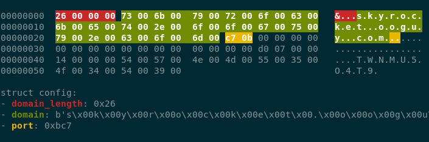

# Part 4 - Malduck

## Setup

```shell
$ python3 -m venv venv
$ source ./venv/bin/activate
$ pip install malduck
```

## **Exercise #4.1**: Getting familiar with Malduck

**Goal**: Learn how Malduck can be used to make your malware analysis life easier

### 1. Explore the CLI

While malduck is primarily used as a python module, it also exposes a few CLI commands. Let's check them out by running `malduck`:

```text
Commands:
  extract    Extract static configuration from dumps
  fixpe      Fix dumped PE file into the correct form
  resources  Extract PE resources from an EXE into a directory
```

We'll come back to `extract` in a few minutes, let's try out `resources` and extract PE resources from [`unknown_sample_07c69147626042067ef9adfa89584a4f93f8ccd24dec87dd8f291d946d465b24.bin`](https://github.com/CERT-Polska/training-mwdb/blob/main/unknown_sample_07c69147626042067ef9adfa89584a4f93f8ccd24dec87dd8f291d946d465b24.bin).

What type of malware is this? Which family?


### 2. Crypto functions

Malduck exposes some of the most commonly used crypto/compression functions used by malware.

See if you can use the exposed functions to decrypt the following cryptograms:

* xor `q9e/n}0` with a password `3v1l!`
* RC4 hexstring `ce8d550107a2b8c58ca6cd2d` using password `black`
* Decrypt hexstring `14a19933083db6f3880f5f48ae86f518` using AES-ECB and the key derived from md5 of `secret`

````{dropdown} Click to see the intended solution
```python
from malduck import xor
# key comes first in args
print(xor(b"3v1l!", b"q9e/n}0"))

from malduck import rc4
print(rc4(key=b"black", data=bytes.fromhex("ce8d550107a2b8c58ca6cd2d")))

from malduck import aes
from hashlib import md5

print(aes.ecb.decrypt(key=md5(b"secret").digest(), data=bytes.fromhex("14a19933083db6f3880f5f48ae86f518")))
```
````

### 3. Disassembly engine

We've compiled the following function to x86 (32bit). Let's see if you can get the secret integer using malducks `disasm` engine!

```c
bool check_secret(unsigned int num) {
    unsigned int result = num ^ SECRET;
    return result == 0;
}
```

Compiled blob: `5589e583ec10e81b000000056d0000008b4508357777adde8945fc837dfc000f94c0c9`


````{dropdown} Click to see the intended solution
```python
from malduck import disasm

assembly = "5589e583ec10e81b000000056d0000008b4508357777adde8945fc837dfc000f94c0c9"

for c in disasm(data=bytes.fromhex(assembly), addr=0):
    if c.mnem == "xor" and c.op2.is_imm:
        value = c.op2.value
        print(f"Found the magic value: {hex(value)}")
```
````


## **Exercise #4.2**: Extracting Warzone RAT C2 server info

**Goal**: Learn how to create malware extraction modules, work on some real-life samples

In this exercise we'll try to create a module that will automatically extract information about the C2 server used in [WARZONE RAT/AVE MARIA](https://malpedia.caad.fkie.fraunhofer.de/details/win.ave_maria)

### 1. Start by downloading archive `warzone_exercise.zip` containing the files for this exercise

* `warzone_samples/*` - these are the malware samples we'll be trying to extract information from
* `modules` - a module extractor stub, you'll need to implement the missing code to make it work

### 2. Preliminary info

Because reverse-engineering malware is out of scope for this course, we'll provide you with enough information that should allow you to create the extractor module without previous knowledge.

* The configuration is stored encrypted in the `.bss` section
* RC4 is used to encrypt the config, the key starts at offset 4 and is always exactly 50 bytes
* The encrypted data is stored right after the key
* The C2 address is encoded using UTF-16 and its length is stored behind it as a little-endian 4-byte integer (see image below for an overview)



### 3. The template

Because boilerplate code can be intimidating at first, we've provided you with a stub module.


* `modules` - directory for all of your extractor modules
  * `warzone` yara rules/python files belonging to this specific module
    *  `warzone.yar` - YARA rule used to detect whether the extraction code should be executed
    * `__init__.py` - The extractor code, the core object is a class that implements the `malduck.extractor.Extractor` interface


### 4. Implementing the module

This one is up to you - use the provided information to decrypt the configuration blob and extract the important information.
Don't be afraid to ask us if you have any questions!

### 5. Running the module

When you're ready (or not) and you would to test the module, you can execute it using the `malduck extract` command like so:

```bash
malduck extract --modules modules <sample_file_or_directory>
```

### 6. Expected results

Assuming you've implemented the module correctly, here are the expected configs:

* `warzone_samples/017c61631075514428dd2183757cd18727db1bb1a4a4aa779ed4e59989f61b94`
```json
{
    "c2": [
        {
            "host": "76.8.53.133",
            "port": 1198
        }
    ],
    "family": "warzone"
}
```

* `warzone_samples/29ac61c528572e6d7bfb8e5ef43ef3650da5de960fa97409fb8e4c279618eb6e`
```json
{
    "c2": [
        {
            "host": "skyrocket.ooguy.com",
            "port": 3015
        }
    ],
    "family": "warzone"
}

```
* `warzone_samples/4562a5e32db3b136439669eb27eb13b6c27232928b92d183c5c94562281f10f7`
```json
{
    "c2": [
        {
            "host": "chezam.giize.com",
            "port": 3698
        }
    ],
    "family": "warzone"
}
```


### 7. Solution

````{dropdown} Click to see the intended solution
```python
class WarzoneRAT(Extractor):
    family = "warzone"
    yara_rules = ("warzone",)

    def handle_match(self, p: procmempe, match: YaraRuleMatch) -> None:
        if not type(p) is procmempe:
            self.log.warning("File is not a PE")
            return

        bss_section = p.pe.section('.bss')

        if not bss_section:
            self.log.warning("Couldn't get bss section")
            return

        data = bss_section.get_data()

        if not data:
            self.log.warning("Couldn't get data from bss")
            return

        data = data[4:]
        decrypted = rc4(data[:50], data[50:])
        if not decrypted:
            self.log.warning("Decrypted data is kinda empty")
            return

        domain_length = uint32(decrypted[:4])
        if domain_length > 100:
            return None

        decrypted = decrypted[4:]

        c2 = decrypted[:domain_length].decode('utf-16')
        decrypted = decrypted[domain_length:]

        c2_port = uint16(decrypted[:2])

        self.push_config({
            "family": "warzone",
            "c2": [{"host": c2, "port": c2_port}],
        })
```
````


## **Exercise #4.3**: Creating extraction modules from the ground up

**Goal**: Create fully fledged extraction modules

### 1. Task

Now that you've gotten familiar with most of Malduck's functions, it's time to put them to use.

The [`crackmes.zip`](https://github.com/CERT-Polska/training-mwdb/blob/main/crackmes.zip) archive contains a bunch of ELF 64-bit binaries. Each one accepts user input from stdin and then prints whether the provided password is correct.

Your task is to create 3 extractor modules (including the YARA rules) that automatically extract the correct user input.

### 2. Hints

* All password are in `flag{<hexdigits>}` format
* You can create the YARA rules just using the output from `strings`
* Remember to pass `x64=True` in disasm calls


### 3. Solution

````{dropdown} View the first module

```yara
rule elf_simple {
    strings:
        $entry_input = "Enter the password"
        $flag_prefix = "flag{"
    condition:
        all of them
}
```

```python
from malduck import Extractor, procmem
from malduck.yara import YaraRuleMatch


class SimpleExtractor(Extractor):
    family = "simple"
    yara_rules = ("elf_simple",)

    @Extractor.string
    def flag_prefix(self, p: procmem, addr: int, matches: YaraRuleMatch):
        return {"flag": p.asciiz(addr)}
```
````

````{dropdown} View the second module

```yara
rule elf_xor {
    strings:
        $entry_input = "What's the secret"
        $function_prologue = { 55 48 89 E5 }
    condition:
        all of them
}
```

```python
from malduck import Extractor, procmem, xor
from malduck.yara import YaraRuleMatch


class XorExtractor(Extractor):
    family = "xor"
    yara_rules = ("elf_xor",)

    @Extractor.string
    def function_prologue(self, p: procmem, addr: int,  matches: YaraRuleMatch):

        data_length = None
        movs = []

        for c in p.disasmv(addr=addr, count=64, x64=True):
            if c.mnem == "movzx" and c.op2.is_mem:
                movs.append(c.op2.value)

            if c.mnem == "cmp" and c.op2.is_imm:
                data_length = c.op2.value
                self.log.info("Found the data length: %d", data_length)
                break
        
        if not data_length:
            self.log.error("Failed to find the data length")
            return None

        if len(movs) != 2:
            self.log.error("Fetched wrong amount of movs")
            return None

        data_addr, key_addr = movs
        key = p.asciiz(key_addr)

        self.log.info("Found the key: %s", key)

        data = p.readv(data_addr, data_length+1)

        return {
            "flag": xor(key, data)
        }
```
````

````{dropdown} View the third module

```yara
rule elf_rc4 {
    strings:
        $entry_input = "Enter the magic word:"
        $function_prologue = { 55 48 89 E5 }
    condition:
        all of them
}
```

```python
from malduck import Extractor, procmem, rc4
from malduck.yara import YaraRuleMatch
from typing import Optional


def try_rc4_decrypt(p: procmem, data_addr, data_length, key_addr) -> Optional[bytes]:
    key = p.asciiz(key_addr)
    data = p.readv(data_addr, data_length)

    if not key or not data:
        return None

    return rc4(key, data)


class RC4Extractor(Extractor):
    family = "rc4"
    yara_rules = ("elf_rc4",)

    @Extractor.string
    def function_prologue(self, p: procmem, addr: int, matches: YaraRuleMatch):
        movs = []

        for c in p.disasmv(addr=addr, count=64, x64=True):
            if c.mnem == "mov" and (c.op2.is_mem or c.op2.is_imm):
                movs.append(c.op2.value)

            if c.mnem == "call":
                if len(movs) >= 3:
                    data_length, data_addr, key_addr = movs[-3:]

                    decrypted = try_rc4_decrypt(p, data_addr, data_length, key_addr)
                    if decrypted and decrypted.startswith(b"flag{"):
                        return {"flag": decrypted}

                movs = []

        return None
```
````

## **Exercise #4.4**: Bonus: Integrating implemented modules into karton-config-extractor

**Goal**: See how it all can be used to automatically extract malware configuration in your karton pipeline

Now that you've created several extractor modules, you'd probably want to see them in action.

Adding your modules to the karton pipeline is pretty straight forward.

Start by installing the `karton-config-extractor`

```shell
pip install karton-config-extractor
```

And then run the service by pointing it to the modules folder:

```shell
karton-config-extractor --modules modules/
```

Upload the samples from earlier exercises and watch the new configs appear!
